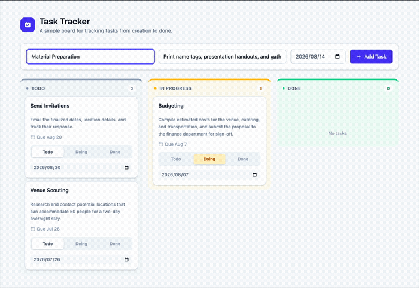

# Simple Task/Project Tracker

Aplikasi task tracker full-stack: REST API dengan FastAPI + PostgreSQL dan frontend Vue 3 (Composition API). Buat tugas, pindahkan antar status `Todo` / `In Progress` / `Done`, dan hapus.



## Stack

- **Backend:** FastAPI, SQLModel (SQLAlchemy + Pydantic), PostgreSQL, python-dotenv
- **Frontend:** Vue 3 (Composition API), Vite, Tailwind CSS, Axios

## Struktur Proyek

```
.
├─ backend/
│  ├─ app/
│  │  ├─ main.py      # Aplikasi FastAPI, routes, CORS
│  │  ├─ models.py    # Model Task, skema Pydantic, validasi
│  │  └─ database.py  # Setup engine/session, membaca .env
│  ├─ requirements.txt
│  └─ .env.example
│
├─ frontend/
│  ├─ src/
│  │  ├─ components/   # TaskForm, KanbanBoard, TaskCard
│  │  ├─ api.js        # Klien Axios
│  │  ├─ useTasks.js   # State task reaktif yang dipakai bersama
│  │  └─ App.vue
│  └─ .env
```

## Prasyarat

- Python 3.10+
- Node.js 18+
- PostgreSQL terpasang dan berjalan secara lokal

## 1. Database

Buat database dan role yang sesuai dengan `backend/.env.example` (atau sesuaikan `.env` pada langkah berikutnya dengan setup milikmu):

```bash
psql -d postgres -c "CREATE ROLE tracker LOGIN PASSWORD 'tracker';"
psql -d postgres -c "CREATE DATABASE tracker OWNER tracker;"
```

PostgreSQL sekarang bisa diakses di `localhost:5432` dengan database `tracker`, user `tracker`, password `tracker`.

## 2. Setup Backend

```bash
cd backend
python3 -m venv .venv
source .venv/bin/activate      # Windows: .venv\Scripts\activate
pip install -r requirements.txt
cp .env.example .env           # sesuaikan kredensial dengan setup PostgreSQL milikmu
uvicorn app.main:app --reload --port 8000
```

API berjalan di `http://localhost:8000`. Tabel dibuat otomatis saat aplikasi dijalankan (`SQLModel.metadata.create_all`) — tidak perlu migrasi manual.

Dokumentasi API interaktif: `http://localhost:8000/docs`

### Endpoint

| Method | Path          | Deskripsi                                    |
|--------|---------------|-------------------------------------------------|
| GET    | `/tasks`      | Mengambil semua daftar tugas                                  |
| POST   | `/tasks`      | Membuat tugas baru (`title`, `description`, `status`, `due_date`)|
| PUT    | `/tasks/{id}` | Memperbarui judul, deskripsi, status, dan/atau tanggal jatuh tempo tugas|
| DELETE | `/tasks/{id}` | Menghapus tugas                                   |

`status` harus salah satu dari `Todo`, `In Progress`, `Done`. `title` tidak boleh kosong — keduanya divalidasi oleh API. `due_date` bersifat opsional (`YYYY-MM-DD`) dan bisa dikosongkan dengan mengirim `null`.

### Environment Variables (`backend/.env`)

| Variabel            | Default     | Deskripsi                  |
|---------------------|-------------|-------------------------------|
| `POSTGRES_USER`     | `tracker`   | User database                 |
| `POSTGRES_PASSWORD` | `tracker`   | Password database              |
| `POSTGRES_DB`       | `tracker`   | Nama database                  |
| `POSTGRES_HOST`     | `localhost` | Host database                  |
| `POSTGRES_PORT`     | `5432`      | Port database                  |
| `CORS_ORIGINS`      | `http://localhost:5173` | Origin yang diizinkan mengakses API, dipisahkan koma |

Kredensial tidak pernah di-hardcode — `database.py` dan `main.py` memuatnya melalui `python-dotenv`.

## 3. Setup Frontend

```bash
cd frontend
npm install
npm run dev
```

Aplikasi berjalan di `http://localhost:5173` dan berkomunikasi dengan API sesuai URL yang dikonfigurasi di `frontend/.env` (`VITE_API_BASE_URL`, default-nya `http://localhost:8000`).

## Menjalankan Semuanya

Pastikan PostgreSQL sudah berjalan, lalu buka dua terminal:

```bash
# 1
cd backend && source .venv/bin/activate && uvicorn app.main:app --reload --port 8000

# 2
cd frontend && npm run dev
```

Lalu buka `http://localhost:5173`.

## Fitur

- **Papan Kanban** — tugas diambil dari API dan dikelompokkan ke dalam tiga kolom (`Todo`, `In Progress`, `Done`).
- **Membuat tugas** — form inline, tanpa reload halaman; kartu baru langsung muncul di kolom `Todo`. Tanggal jatuh tempo bersifat opsional.
- **Mengubah status** — kontrol segmented pada tiap kartu untuk memindahkannya ke kolom lain via `PUT`, langsung terlihat perubahannya.
- **Tanggal jatuh tempo** — atur atau ubah per kartu; tugas yang lewat jatuh tempo (dan belum `Done`) ditandai warna merah.
- **Menghapus tugas** — dihapus via `DELETE` dan papan langsung diperbarui.
- Tampilan bersih dan responsif menggunakan Tailwind CSS.
